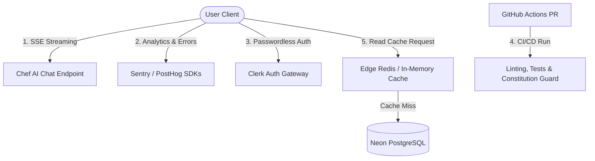

# Global Plate: Specification Version 2.0.0 (World-Class Scale)

## Document Metadata
- **Status**: Ratified Spec
- **Version**: 2.0.0
- **Modified**: 2026-06-25
- **Branch**: `main`
- **Context**: Product-System Era (Version 2 Expansion)

---

## 1. Executive Summary & Vision

Global Plate is an AI-native recipe companion designed to guide home cooks through global masterworks with complete clarity, safety, and personalized metaphors. Version 1 established the foundational 5-step multilingual recipes, RAG retrieval system, and offline capabilities. Version 2.0 elevates the system to world-class scale, integrating real-time streaming, telemetry, enterprise-grade authentication, automated pipeline checks, and high-performance edge caching.

---

## 2. Foundational V1 Architecture, Schemas, & UI Rules

### 2.1 Core Constitution Principles
1. **Accessibility-First (RTL & Mobile)**:
   - Native Right-to-Left (RTL) mirroring for Urdu (`ur`), Arabic (`ar`), and Persian (`fa`).
   - Minimum tap target size of 44x44px for touch interfaces.
   - High contrast (minimum WCAG AA 4.5:1 ratio) on all interactive steps.
2. **Beginner-Centric Simplicity**:
   - Hard constraint of a maximum of 5 steps per recipe.
   - "One action per step" to minimize cognitive load.
   - Elimination of professional culinary jargon.
3. **Safety Mandatory (Kitchen Guard)**:
   - Distinct, localized "Kitchen Guard" warning displayed before high-risk steps (e.g., heat, hot oil, sharp tools).
   - Validation hooks to block publishing if safety fields are missing.
4. **Tech Stack Discipline (V1.2)**:
   - **Backend**: FastAPI (Python 3.11)
   - **Database**: Neon Serverless PostgreSQL
   - **Vector DB**: Qdrant Cloud (embeddings using OpenAI `text-embedding-3-small` / 1536 dims)
   - **Frontend**: Docusaurus 3.x with React 18 & TypeScript 5.x
   - **Styling**: Tailwind CSS
5. **Multi-Modal Excellence**:
   - Web Speech API client-side Speech-to-Text (STT) routed to `/recipes/search` as text strings.
   - Text-to-Speech (TTS) step reading.
   - Sub-2 second voice response latency (p95).
6. **Metaphor Personalization**:
   - Personalization Engine that matches user background (e.g., Software Engineering, Hardware, General Cooking) with custom analogies (e.g., "Compiling your Sajji ingredients").
7. **Systemic Interactivity (The Living Book)**:
   - Interactive checklist for ingredients.
   - Persistent step-progress synchronization.
   - "Cook Mode": stays awake (Wake Lock API / `NoSleep.js`), fullscreen, and utilizes large, high-contrast text.
8. **Big-Tech UI/UX Aesthetic**:
   - Dark-mode first default theme.
   - Command+K instant global search modal (fuzzy matching, <300ms query).
9. **Conversational "Chef AI" Intelligence**:
   - "Fridge Logic": Suggest recipes based on user-supplied available ingredients.
   - Substitutions search (100+ ingredient DB).
   - Strict compliance filters ensuring AI outputs remain Halal (no pork, no alcohol, proper slaughter).

### 2.2 Relational Data Schema (V1.2)
```sql
CREATE TABLE recipes (
    recipe_id UUID PRIMARY KEY DEFAULT gen_random_uuid(),
    name VARCHAR(255) NOT NULL,
    origin_country VARCHAR(100) NOT NULL,
    difficulty VARCHAR(50) CHECK (difficulty IN ('Absolute Beginner', 'Beginner', 'Beginner+')),
    prep_time INT NOT NULL, -- minutes
    cook_time INT NOT NULL,
    total_time INT NOT NULL,
    servings INT NOT NULL,
    created_at TIMESTAMP WITH TIME ZONE DEFAULT CURRENT_TIMESTAMP,
    updated_at TIMESTAMP WITH TIME ZONE DEFAULT CURRENT_TIMESTAMP,
    is_active BOOLEAN DEFAULT TRUE
);

CREATE TABLE recipe_translations (
    translation_id UUID PRIMARY KEY DEFAULT gen_random_uuid(),
    recipe_id UUID REFERENCES recipes(recipe_id) ON DELETE CASCADE,
    language_code VARCHAR(5) CHECK (language_code IN ('en', 'ur', 'ar', 'es', 'fr', 'fa')),
    name VARCHAR(255) NOT NULL,
    kitchen_guard TEXT NOT NULL,
    ingredients JSONB NOT NULL, -- list of {name, quantity, unit}
    created_at TIMESTAMP WITH TIME ZONE DEFAULT CURRENT_TIMESTAMP,
    updated_at TIMESTAMP WITH TIME ZONE DEFAULT CURRENT_TIMESTAMP,
    UNIQUE(recipe_id, language_code)
);

CREATE TABLE recipe_steps (
    step_id UUID PRIMARY KEY DEFAULT gen_random_uuid(),
    recipe_id UUID REFERENCES recipes(recipe_id) ON DELETE CASCADE,
    step_number INT CHECK (step_number BETWEEN 1 AND 5),
    instruction TEXT NOT NULL,
    audio_clip_url VARCHAR(512),
    image_url VARCHAR(512),
    created_at TIMESTAMP WITH TIME ZONE DEFAULT CURRENT_TIMESTAMP
);

CREATE TABLE recipe_step_translations (
    step_translation_id UUID PRIMARY KEY DEFAULT gen_random_uuid(),
    step_id UUID REFERENCES recipe_steps(step_id) ON DELETE CASCADE,
    language_code VARCHAR(5) NOT NULL,
    instruction TEXT NOT NULL,
    created_at TIMESTAMP WITH TIME ZONE DEFAULT CURRENT_TIMESTAMP,
    UNIQUE(step_id, language_code)
);

CREATE TABLE user_recipe_progress (
    progress_id UUID PRIMARY KEY DEFAULT gen_random_uuid(),
    user_id VARCHAR(255) NOT NULL,
    recipe_id UUID REFERENCES recipes(recipe_id) ON DELETE CASCADE,
    current_step INT NOT NULL DEFAULT 0,
    cook_mode_active BOOLEAN DEFAULT FALSE,
    updated_at TIMESTAMP WITH TIME ZONE DEFAULT CURRENT_TIMESTAMP,
    UNIQUE(user_id, recipe_id)
);
```

---

## 3. Version 2.0 Architecture: The Five Pillars

Version 2.0 introduces production-grade, enterprise-scale features to transform Global Plate into a world-class platform.



### Pillar 1: Real-Time AI Streaming (Server-Sent Events)
- **Concept**: Users expect immediate interactive feedback. Waiting for a complete LLM generation causes high bounce rates. Token-by-token streaming is mandated for the Chef AI interface.
- **Backend Specification**:
  - Implement a FastAPI `/api/chef-ai/stream` endpoint returning a `StreamingResponse` using the `text/event-stream` media type.
  - Utilize OpenAI's stream parameter (`stream=True`) in the Chat Completions API.
  - Wrap stream output in an asynchronous generator that yields standardized chunks formatted as JSON:
    ```json
    data: {"token": "next_word", "done": false}
    ```
  - Safe-guard mechanism: Implement a fast pre-flight Halal compliance filter (checks queries for keywords like "pork", "alcohol", "wine", etc. in all 6 target languages) before streaming begins.
- **Frontend Specification**:
  - The `ChefAiDrawer` client uses the Fetch API with readable streams (via custom hook or `@microsoft/fetch-event-source`) instead of standard REST requests.
  - UI must progressively append tokens to the chat bubble, preserving markdown syntax rendering in real-time.
  - Implement dynamic auto-scroll to lock view to the bottom of the chat as text renders.

### Pillar 2: Telemetry & Observability (Sentry / PostHog)
- **Concept**: Complete visibility into system errors, performance bottlenecks, and user interaction patterns.
- **Sentry Integration**:
  - **Backend**: Configure `sentry-sdk` with FastAPI integrations inside `backend/src/main.py`. Set `traces_sample_rate` to 1.0 in development and 0.1 in production. Capture all HTTP 500 errors and long-running database queries.
  - **Frontend**: Initialize `@sentry/react` in Docusaurus root layout. Track component crash stacks and performance of route changes.
  - Track API endpoint latencies to enforce the 500ms API retrieval budget.
- **PostHog Analytics**:
  - Initialize the PostHog JavaScript SDK in the frontend entrypoint.
  - Automatically log events for:
    - `cook_mode_toggled` (state, recipe_id)
    - `recipe_scaled` (recipe_id, servings)
    - `command_k_search` (query, time_taken)
    - `voice_query_triggered` (language)
    - `pdf_downloaded` (recipe_id)
  - Ensure GDPR compliance by masking PII and offering opt-out toggles in the user profile page.

### Pillar 3: Passwordless Auth (Clerk Freemium Model)
- **Concept**: Seamless user onboarding with zero password friction. Replace the local Better-Auth implementation with a production-grade managed auth provider.
- **Frontend Integration**:
  - Mount Clerk's `<SignUp />` and `<SignIn />` components to custom route templates in the frontend.
  - Customize Clerk's visual theme to match the dark-theme-first, minimalist design system of Global Plate.
  - Expose user profile details (background type, level) securely through user metadata.
- **Backend Security**:
  - Protect all mutation APIs (updating recipe progress, saving ingredients check, rating AI suggestions) with JWT verification middleware.
  - Use `PyJWT` or `python-jose` to fetch and cache Clerk's JSON Web Key Set (JWKS).
  - Verify the signature, issuer, and expiration of the Bearer token, extracting the `user_id` to scope all SQL query requests.

### Pillar 4: CI/CD Pipelines (GitHub Actions)
- **Concept**: Automated validation of code quality, structural tests, and strict enforcement of the constitution before deployment.
- **Workflows**:
  - **CI Lint & Test** (`ci.yml`):
    - Runs on every Pull Request targeting the `main` branch.
    - Sets up Python 3.11 environment, runs `black --check`, `ruff check`, and executes backend tests (`pytest`).
    - Sets up Node.js environment, installs frontend packages, runs ESLint (`npm run lint`), and builds the static Docusaurus output.
  - **Constitution Guard** (`constitution-check.yml`):
    - Executed on PR submit. Runs a custom test suite checking the database seeds and JSON locales.
    - Assertions: (1) Check that all recipes have a max of 5 steps. (2) Verify the presence of a "Kitchen Guard" warning for each recipe. (3) Confirm all 6 target languages (`en`, `ur`, `ar`, `es`, `fr`, `fa`) are represented.
  - **CD Pipeline** (`cd.yml`):
    - Triggers automatically upon merges to `main`.
    - Deploys static frontend assets to Vercel.
    - Deploys FastAPI backend service to Vercel/Hugging Face Spaces.
    - Executes database migration scripts (`alembic upgrade head`) as an isolated pre-deploy step.

### Pillar 5: Edge Caching (Redis / In-Memory Cache)
- **Concept**: Ensure p95 recipe retrieval latency remains below 500ms, even under heavy concurrent user traffic.
- **Edge Cache Layer**:
  - Connect backend to a Redis cluster (e.g., Upstash Redis) using `redis-py` or `aioredis`.
  - Cache target: Single recipe retrieval (`GET /recipes/{recipeId}`) and listing configurations.
  - **Fallback Logic**: If Redis is unreachable, log the warning to Sentry and automatically fall back to a thread-safe local in-memory dict cache (using `cachetools` with a 5-minute TTL) to maintain high availability.
  - **Invalidation Strategy**: Set a TTL of 3600 seconds (1 hour) on cache records. Trigger active invalidation on specific cache keys when recipe translations or database entries are modified by administrative actions.

---

## 4. Architectural Constraints & Budgets

| Metric | Target | Enforcer |
| :--- | :--- | :--- |
| **Recipe Retrieval Latency** | <500ms (p95) | Redis Cache + Neon Connection Pool |
| **Chef AI Time-To-First-Token** | <400ms (p95) | SSE Streaming + OpenAI streaming |
| **Command+K Search Latency** | <300ms (p95) | Client-side Fuzzy Index (cmdk) |
| **Test Coverage minimum** | 80% (Backend) | CI Codecov Gate |
| **Safety Warning Presence** | 100% | Constitution Guard workflow |
| **Language Conformity** | 6 Target Locales | JSON file schema validation tests |

---

## 5. Security & Privacy

1. **Secrets Management**: All API keys (Clerk secret key, Qdrant API key, OpenAI API key, Redis URL, Sentry DSN) are injected via system environment variables. Never commit credentials to git.
2. **Access Control**: Relational tables scoped by user IDs verified via Clerk signature checks. Database queries must enforce `user_id = current_user` limits on personal progress tables.
3. **Audit Logging**: Maintain log trails for authentication updates and critical database edits for monitoring and audit purposes.
